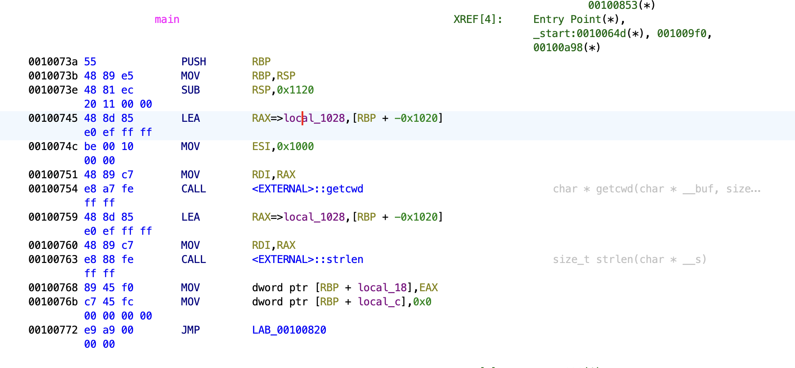
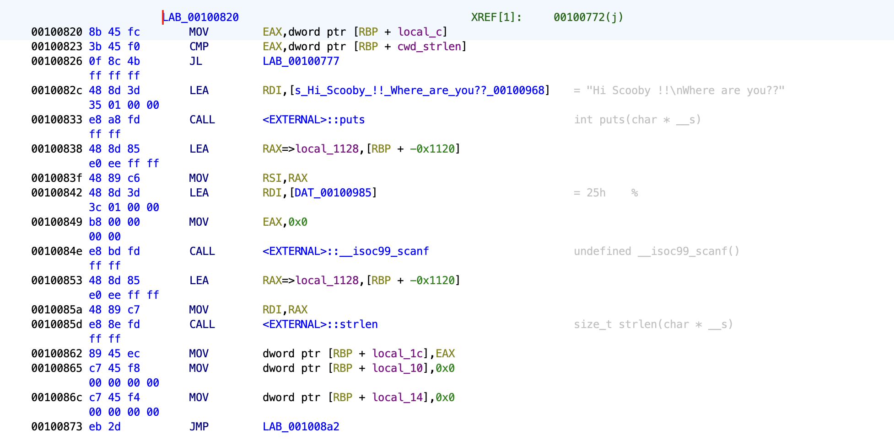
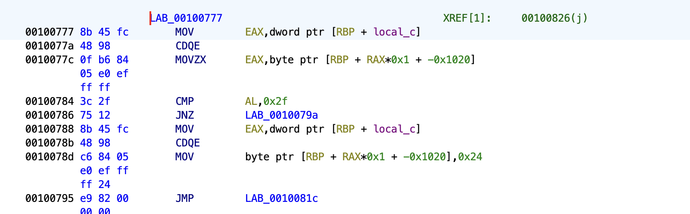
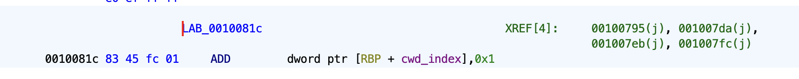
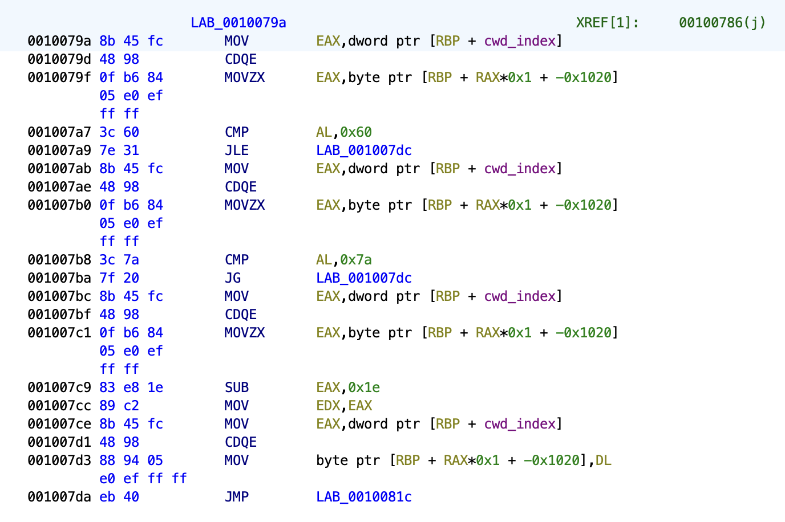
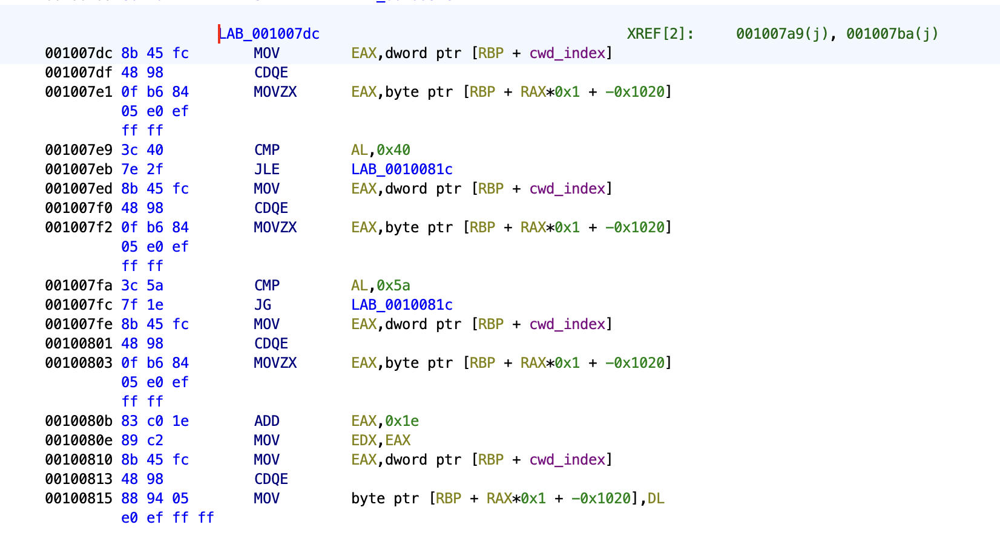
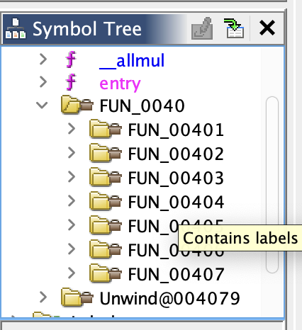
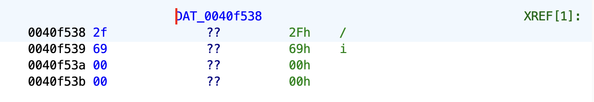
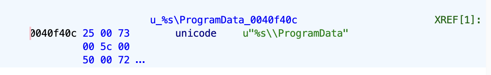
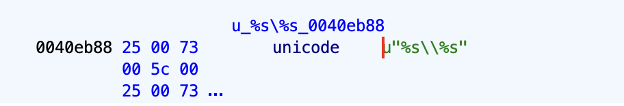

# Report

## Theory

Reverse engineering is the process of taking a compiled program, disassembling the program to get the assembly code and figuring out how the program works without the source code. In the context of security, reverse engineering is important for malware analysis and protecting your own systems from being reverse engineered.


### The Stack


The very first step is to get a strong understanding of low level programming and assembly, and the very first step of that was understanding the stack.

The stack is the way computers track locations of data. For each function call, data related to this function is stored relative to the base pointer of the function.

To illustrate how the stack works, lets track the stack operations for a simple C program below:

```
void main() {
    char string[] = "Hello world!";
    printf("%d", x);
}
```

At the start of the program, the _start() function is executed. Some base pointer value corresponding to _start() is pushed onto the stack. The main function is then called. We then set EBP, the register containing the base pointer to ESP, the register containing the stack pointer. The stack pointer and base pointer are currently equal. In this example we will use address 20. The first thing our main function needs to do is to reserve memory for our "Hello world!" string. Our string consists of 13 bytes and so we will need to allocate 13 bytes of memory. This is done by subtracting 13 from our stack pointer. Note that the stack generally grows downwards, hence subtraction. Our stack pointer is not pointed at address 7. Notice there is 13 bytes between the base pointer and the stack pointer with which we are free to assign characters corresponding to our string. Next, the program calls the printf function. For the function call to work, the print function requires 2 things:

1. The return address - where should the computer resume executing after returning from the function
2. The parameters

To store the return address, we push the address of the current instruction onto the stack. We similarly push the parameters for the function, in this case the format string "%d" and the string. While generally the address is pushed first then the parameters in reverse order, the particular way in which the values are pushed are not important, as long as the callee also knows how the paramters and such are pushed so they can access them. Finally we also push the base pointer in EBP onto the stack. We can now execute the first line of printf. An important thing to note is that the base pointer on the stack is the base pointer of the previous stack frame. The value in EBP is the base pointer of the current stack frame.

### Application Binary Interface 

How exactly are functions called? The ABI is a standard agreed upon by two modules such that they know how to communicate with each other. Say we have a function that requires two arguments. The function must specify that they will receive the arguments from either the register or the stack. The caller must know this and pass the arguments in the right way. This is why we cant use a linux library with a program designed for windows. These protocols are known as calling conventions which make up part of the ABI.


For example, the AMD64 System V ABI passes parameters in R registers (given the parameters fit in the registers) in reverse order and pass the return value back in RAX. This is why one of the first steps of reverse engineering is understanding the architecture you are working with. Its easy to get mixed up if you misconstrue the ABI of a different system with the one you are working with.

## In the context of security

Revrse engineering can simply be thought of as figuring out how a program works. In that case, it becomes fairly clear to see the importance of it in security.

1. Discovering exploits

Knowing the implementation details of a program makes it much easier to discover exploits in a program. This is why source code leaks can be dangerous. If someone is skilled enough however, they can technically build the source code themselves entirely leading to potentially discovering exploits in the process.

2. Malware analysis

Malware analysis allows the analyser to identify
* How much damage was caused
* Find the vulnerability that was exploited
* Potentially find the perpetrator
Essentially, there are many reasons why one might want to analyse malware. In the case of Wannacry which I attempt to reverse below, we can try to analyse the program so we can find out how to decrypt ransomed files.


## Obfuscation

Naturally, if there are people trying reverse engineer programs, there are people trying to stop their programs from being reverse engineered. This is done through code obfuscation. Essentially, making the disassembled machine code confusing and difficult to decipher. Here are a couple ways to obfuscate code:

1. Renaming symbols. The most common way to obfuscate code. This is done in pretty much all modern applications. While not the most effective method, it comes with two significant benefits: it is easy to do and has no performance overhead.
2. Packing code. Compressing the code such that it is smaller and more difficult to understand. For example, Huffman coding can be used to compress repeated sections
3. Instruction and control flow transformation. Executing a simple single instruction with 10 complicated ones that do the same thing. Transform a simple if else into a complex branch of control flows which actually just lead to the same results.
4. Dummy code. Insert lots of code which does nothing.
5. Stripping metadata. Remove as much context from the code as possible to make it more difficult to understand.

It is generally fairly easy to obfuscate code. Most of it can be done quickly and without too much computation. However, more effective obfuscation such as instruction transformations can come with significant performance overhead. Denuvo is a DRM system usually used to obfuscate videogames for copy protection. While extremely powerful and difficult to reverse, it comes with a hefty performance cost.


## Crackmes

I spent a decent chunk of my time just working through crackmes. Here are some the ones I worked through and my process for each of them.

### level1

The very first crackme I tried. Extremely simple, but was important to familiarising myself with reading disassembled code. Here is a walkthrough:

https://youtu.be/T_jDls5rE64

### Save Scooby

Here's the main function of Save Scooby, a Linux based x86_64 program. 



We see two library functions getcwd and strlen. We can see that local_1028 is moved into RDI and 0x1000 is moved in ESI. From what we know about the System V AMD64 ABI, local_1028 must be the first argument and 0x1000 the second argument of getcwd. Its easy to conlude that local_1028 contains the pointer to the buffer that getcwd will read into and 0x1000 the size of the buffer. Similarly local_18 contains the strlen of cwd since EAX is generally used as the return register. Lets rename local_1028 to cwd and local_18 to cwd_strlen.

Jumping to the label at the bottom, we see this:



local_c currently contains the constant 0, less than cwd_strlen. The CMP instruction therefore sets the zero flag is set to 0 and the carry flag set to 1 and we jump to the JL label.



After moving local_c into EAX, we see this CDQE instruction. CDQE converts a DWORD to a QWORD. Essentially, it takes the value in EAX and extends it into the RAX register. We then move with zero extend (MOVZX) [RBP + RAX*0x1 + -0x1020]. -0x1020 is actually equal to the cwd offset we renamed earlier. For some reason Ghidra hasnt renamed the offset. This might be a bug where the offset appears in a different context (i.e. with the RAX offset between RBP and 0x1020), but im not sure. Anyway RAX contains zero, so this instruction just moves the first character of cwd into EAX. Clearly, the local_c variable is used to index cwd, so we will rename it as such. We then see a comparison between AL and 0x2f which represents the '/' character. If they are equal, we do not jump and replace '/' with 0x24, the '$' character. We then jump to the label at the bottom.



This label simply simply has the add instruction then is immediately followed by the label we were at from two jumps ago. So we can see that we have a loop incrementing the cwd index each time. Lets go back the previous label and see what happens if the indexed cwd character is not equal to '/'.  We instead jump to this label:



We see that our character is compared against 0x60, '\`' and 0x7A, 'z'. This range happens to be all the lowercase letters. If our character is a lowercase letter we subtract 0x1e from our character and replace it. We then execute the loop again. If our character is not a lowe case letter, we jump to this label:



This time we check if our character is in the range of 0x40, '@' and 0x5a, 'Z'. Clearly, this time we check for capital letters. If so, this time we add 0x1e. Otherwise we jump to this label


which simply increments our cwd index and repeats the loop. Basically, we remove any not alpha characters other than '/'. And that is basically it. The program continues by checking our input against this new string, setting our flag if the strings are equal. The program generates a key by offsetting alpha characters by either adding or subtracting 0x1e and replacing '/' with '$' from the cwd. Writing a keygen which does this is trivial.

## WannaCry

### Background

The WannaCry attack was a massive cyberattack that happened in 2017. The ransomware would take your files and encrypt them, requiring the user to pay a ransom in bitcoin if they wanted their files back. There is a youtube video of stacksmashing reversing it online here https://www.youtube.com/watch?v=Sv8yu12y5zM&t=463s. However, their version of wannacry seemed substantially different to mine and so it didn't provide me with as much help as I would like. It was useful for familiarising me with some common Microsoft specific functions and details which I am not familiar with however.

I originally attempted to do this without using the decompiler, but turned out to be incredibly difficult and time consuming. So as I go further I start using the decompiler much more liberally.

Here I try to reverse engineer some of it.


### Reversing

Here's the first thing we get after analysing the file in Ghidra.

                             **************************************************************
                             *                          FUNCTION                          *
                             **************************************************************
                             undefined entry()
                               assume FS_OFFSET = 0xffdff000
             undefined         AL:1           <RETURN>
             undefined4        Stack[-0x8]:4  local_8                                 XREF[1]:     004077e2(W)  
             undefined4        Stack[-0x1c]:4 local_1c                                XREF[1]:     004077dd(W)  
             undefined2        Stack[-0x30]:2 local_30                                XREF[1]:     004078ca(R)  
             undefined4        Stack[-0x34]:4 local_34                                XREF[2]:     004078b7(W), 
                                                                                                   004078c4(R)  
             undefined1        Stack[-0x60]:1 local_60                                XREF[1]:     004078ba(*)  
             undefined1        Stack[-0x64]:1 local_64                                XREF[1]:     0040786b(*)  
             undefined1        Stack[-0x68]:1 local_68                                XREF[1]:     00407863(*)  
             undefined4        Stack[-0x6c]:4 local_6c                                XREF[1]:     004078ee(W)  
             undefined4        Stack[-0x70]:4 local_70                                XREF[2]:     00407856(W), 
                                                                                                   00407859(*)  
             undefined1        Stack[-0x74]:1 local_74                                XREF[1]:     00407867(*)  
             undefined4        Stack[-0x78]:4 local_78                                XREF[4]:     0040788e(W), 
                                                                                                   00407897(W), 
                                                                                                   004078aa(W), 
                                                                                                   004078d6(W)  
                             entry                                           XREF[2]:     Entry Point(*), 00400120(*)  
        004077ba 55              PUSH       EBP
        004077bb 8b ec           MOV        EBP,ESP
        004077bd 6a ff           PUSH       -0x1
        004077bf 68 88 d4        PUSH       DAT_0040d488                                     = FFh
                 40 00
        004077c4 68 f4 76        PUSH       DAT_004076f4                                     = FFh
                 40 00
        004077c9 64 a1 00        MOV        EAX,FS:[0x0]=>ExceptionList                      = 00000000
                 00 00 00
        004077cf 50              PUSH       EAX
        004077d0 64 89 25        MOV        dword ptr FS:[0x0]=>ExceptionList,ESP            = 00000000
                 00 00 00 00
        004077d7 83 ec 68        SUB        ESP,0x68
        004077da 53              PUSH       EBX
        004077db 56              PUSH       ESI
        004077dc 57              PUSH       EDI
        004077dd 89 65 e8        MOV        dword ptr [EBP + local_1c],ESP
        004077e0 33 db           XOR        EBX,EBX
        004077e2 89 5d fc        MOV        dword ptr [EBP + local_8],EBX
        004077e5 6a 02           PUSH       0x2
        004077e7 ff 15 c4        CALL       dword ptr [->MSVCRT.DLL::__set_app_type]         = 0000df32
                 81 40 00
        004077ed 59              POP        ECX
        004077ee 83 0d 4c        OR         dword ptr [DAT_0040f94c],0xffffffff
                 f9 40 00 ff
        004077f5 83 0d 50        OR         dword ptr [DAT_0040f950],0xffffffff
                 f9 40 00 ff
        004077fc ff 15 c0        CALL       dword ptr [->MSVCRT.DLL::__p__fmode]             = 0000df24
                 81 40 00
        00407802 8b 0d 48        MOV        ECX,dword ptr [DAT_0040f948]
                 f9 40 00
        00407808 89 08           MOV        dword ptr [EAX],ECX
        0040780a ff 15 bc        CALL       dword ptr [->MSVCRT.DLL::__p__commode]           = 0000df14
                 81 40 00
        00407810 8b 0d 44        MOV        ECX,dword ptr [DAT_0040f944]
                 f9 40 00
        00407816 89 08           MOV        dword ptr [EAX],ECX
        00407818 a1 b8 81        MOV        EAX,[->MSVCRT.DLL::_adjust_fdiv]                 = 0000df04
                 40 00
        0040781d 8b 00           MOV        EAX,dword ptr [EAX]
        0040781f a3 54 f9        MOV        [DAT_0040f954],EAX
                 40 00
        00407824 e8 16 01        CALL       FUN_0040793f                                     undefined FUN_0040793f()
                 00 00
        00407829 39 1d 70        CMP        dword ptr [DAT_0040f870],EBX                     = 00000001h
                 f8 40 00
        0040782f 75 0c           JNZ        LAB_0040783d
        00407831 68 3c 79        PUSH       LAB_0040793c
                 40 00
        00407836 ff 15 b4        CALL       dword ptr [->MSVCRT.DLL::__setusermatherr]       = 0000def0
                 81 40 00
        0040783c 59              POP        ECX
                             LAB_0040783d                                    XREF[1]:     0040782f(j)  
        0040783d e8 e8 00        CALL       FUN_0040792a                                     undefined FUN_0040792a()
                 00 00
        00407842 68 0c e0        PUSH       DAT_0040e00c
                 40 00
        00407847 68 08 e0        PUSH       DAT_0040e008
                 40 00
        0040784c e8 d3 00        CALL       MSVCRT.DLL::_initterm                            undefined _initterm()
                 00 00
        00407851 a1 40 f9        MOV        EAX,[DAT_0040f940]
                 40 00
        00407856 89 45 94        MOV        dword ptr [EBP + local_70],EAX
        00407859 8d 45 94        LEA        EAX=>local_70,[EBP + -0x6c]
        0040785c 50              PUSH       EAX
        0040785d ff 35 3c        PUSH       dword ptr [DAT_0040f93c]
                 f9 40 00
        00407863 8d 45 9c        LEA        EAX=>local_68,[EBP + -0x64]
        00407866 50              PUSH       EAX
        00407867 8d 45 90        LEA        EAX=>local_74,[EBP + -0x70]
        0040786a 50              PUSH       EAX
        0040786b 8d 45 a0        LEA        EAX=>local_64,[EBP + -0x60]
        0040786e 50              PUSH       EAX
        0040786f ff 15 ac        CALL       dword ptr [->MSVCRT.DLL::__getmainargs]          = 0000ded4
                 81 40 00
        00407875 68 04 e0        PUSH       DAT_0040e004
                 40 00
        0040787a 68 00 e0        PUSH       DAT_0040e000
                 40 00
        0040787f e8 a0 00        CALL       MSVCRT.DLL::_initterm                            undefined _initterm()
                 00 00
        00407884 83 c4 24        ADD        ESP,0x24
        00407887 a1 a8 81        MOV        EAX,[->MSVCRT.DLL::_acmdln]                      = 0000deca
                 40 00
        0040788c 8b 30           MOV        ESI,dword ptr [EAX]
        0040788e 89 75 8c        MOV        dword ptr [EBP + local_78],ESI
        00407891 80 3e 22        CMP        byte ptr [ESI],0x22
        00407894 75 3a           JNZ        LAB_004078d0
                             LAB_00407896                                    XREF[1]:     004078a2(j)  
        00407896 46              INC        ESI
        00407897 89 75 8c        MOV        dword ptr [EBP + local_78],ESI
        0040789a 8a 06           MOV        AL,byte ptr [ESI]
        0040789c 3a c3           CMP        AL,BL
        0040789e 74 04           JZ         LAB_004078a4
        004078a0 3c 22           CMP        AL,0x22
        004078a2 75 f2           JNZ        LAB_00407896
                             LAB_004078a4                                    XREF[1]:     0040789e(j)  
        004078a4 80 3e 22        CMP        byte ptr [ESI],0x22
        004078a7 75 04           JNZ        LAB_004078ad
                             LAB_004078a9                                    XREF[1]:     004078b5(j)  
        004078a9 46              INC        ESI
        004078aa 89 75 8c        MOV        dword ptr [EBP + local_78],ESI
                             LAB_004078ad                                    XREF[2]:     004078a7(j), 004078d3(j)  
        004078ad 8a 06           MOV        AL,byte ptr [ESI]
        004078af 3a c3           CMP        AL,BL
        004078b1 74 04           JZ         LAB_004078b7
        004078b3 3c 20           CMP        AL,0x20
        004078b5 76 f2           JBE        LAB_004078a9
                             LAB_004078b7                                    XREF[1]:     004078b1(j)  
        004078b7 89 5d d0        MOV        dword ptr [EBP + local_34],EBX
        004078ba 8d 45 a4        LEA        EAX=>local_60,[EBP + -0x5c]
        004078bd 50              PUSH       EAX
        004078be ff 15 c4        CALL       dword ptr [->KERNEL32.DLL::GetStartupInfoA]      = 0000df5e
                 80 40 00
        004078c4 f6 45 d0 01     TEST       byte ptr [EBP + local_34],0x1
        004078c8 74 11           JZ         LAB_004078db
        004078ca 0f b7 45 d4     MOVZX      EAX,word ptr [EBP + local_30]
        004078ce eb 0e           JMP        LAB_004078de
                             LAB_004078d0                                    XREF[2]:     00407894(j), 004078d9(j)  
        004078d0 80 3e 20        CMP        byte ptr [ESI],0x20
        004078d3 76 d8           JBE        LAB_004078ad
        004078d5 46              INC        ESI
        004078d6 89 75 8c        MOV        dword ptr [EBP + local_78],ESI
        004078d9 eb f5           JMP        LAB_004078d0
                             LAB_004078db                                    XREF[1]:     004078c8(j)  
        004078db 6a 0a           PUSH       0xa
        004078dd 58              POP        EAX
                             LAB_004078de                                    XREF[1]:     004078ce(j)  
        004078de 50              PUSH       EAX
        004078df 56              PUSH       ESI
        004078e0 53              PUSH       EBX
        004078e1 53              PUSH       EBX
        004078e2 ff 15 a4        CALL       dword ptr [->KERNEL32.DLL::GetModuleHandleA]     = 0000db12
                 80 40 00
        004078e8 50              PUSH       EAX
        004078e9 e8 f9 a6        CALL       FUN_00401fe7                                     undefined FUN_00401fe7()
                 ff ff
        004078ee 89 45 98        MOV        dword ptr [EBP + local_6c],EAX
        004078f1 50              PUSH       EAX
        004078f2 ff 15 a4        CALL       dword ptr [->MSVCRT.DLL::exit]                   = 0000dec2
                 81 40 00
                             -- Flow Override: CALL_RETURN (COMPUTED_CALL_TERMINATOR)


The first thing you might notice is that we aren't at the main function. This is because unlike the programs earlier, the symbols in the file have been stripped, likely to make it harder to reverse. Looking at the symbol tree we can see that the functions and variables are all labelled some variant of FUN and DAT rather than the actual names.



We do however have entry function which we can start from. To find our main function, we are looking for a few indicators:

1. The second to last function call, the final function call should always be the exit function.
2. 3 or 4 arguments - unlike a standard OS independant main function with argc and argv, visual studio will instead use winMain, a specific main function built for windows programs which has 4 arguments.
3. A large hex value as one of the arguments. One of the arguments for winMain is hInstance, the images/image base where the program will be loaded, so we expect a large value.
4. The return value may be an integer passed into the exit function.

Looking at the call to FUN_00401fe7, this fits most of our criteria. we have three arguments EAX, ESI, EBX and the return value is passed into the exit function. This is likely our main function. Lets jump into the function and update the signature as we go along.

                             WinMain                                         XREF[1]:     entry:004078e9(c)  
        00401fe7 55              PUSH       EBP
        00401fe8 8b ec           MOV        EBP,ESP
        00401fea 81 ec e4        SUB        ESP,0x6e4
                 06 00 00
        00401ff0 a0 10 f9        MOV        AL,[DAT_0040f910]
                 40 00
        00401ff5 53              PUSH       EBX
        00401ff6 56              PUSH       ESI
        00401ff7 57              PUSH       EDI
        00401ff8 88 85 f4        MOV        byte ptr [EBP + local_210],AL
                 fd ff ff
        00401ffe b9 81 00        MOV        ECX,0x81
                 00 00
        00402003 33 c0           XOR        EAX,EAX
        00402005 8d bd f5        LEA        EDI=>local_20f,[EBP + 0xfffffdf5]
                 fd ff ff
        0040200b f3 ab           STOSD.REP  ES:EDI
        0040200d 66 ab           STOSW      ES:EDI
        0040200f aa              STOSB      ES:EDI
        00402010 8d 85 f4        LEA        EAX=>local_210,[EBP + 0xfffffdf4]
                 fd ff ff
        00402016 68 08 02        PUSH       0x208
                 00 00
        0040201b 33 db           XOR        EBX,EBX
        0040201d 50              PUSH       EAX
        0040201e 53              PUSH       EBX
        0040201f ff 15 8c        CALL       dword ptr [->KERNEL32.DLL::GetModuleFileNameA]   = 0000dab2
                 80 40 00
        

Heres is the first code block up until the first funtion call. When reversing real programs, its not feasible to look at every instruction and try to understand it. The best way to get a rough understanding of what's happening is to look at the function calls. The first call we make is to GetModuleFileNameA. Looking at the Microsoft documentation, we see that it simply stores the path of a module into a buffer. This is the signature : `DWORD GetModuleFileNameA (HMODULE hModule, LPSTR lpFilename, DWORD nSize)`. Notice that it is only supplied two arguments in EAX and EBX. This is because the first argument, the module, is optional. If no module is supplied, the function simply gets the path of the executable. So now our variable loc_210 stores the path of this program.


        00402025 68 ac f8        PUSH       DAT_0040f8ac
                 40 00
        0040202a e8 f6 f1        CALL       FUN_00401225                                     undefined FUN_00401225(undefined
                 ff ff
        0040202f 59              POP        ECX
        00402030 ff 15 6c        CALL       dword ptr [->MSVCRT.DLL::__p___argc]             = 0000ddce
                 81 40 00

Next we push some unknown data onto our stack and call some function. Lets go into this function.

                             **************************************************************
                             *                          FUNCTION                          *
                             **************************************************************
                             undefined FUN_00401225(undefined4 param_1)
                               assume FS_OFFSET = 0xffdff000
             undefined         AL:1           <RETURN>
             undefined4        Stack[0x4]:4   param_1                                 XREF[3]:     004012c8(R), 
                                                                                                   004012e5(R), 
                                                                                                   004012f1(R)  
             undefined4        Stack[-0x8]:4  local_8                                 XREF[3]:     0040126b(RW), 
                                                                                                   0040128c(RW), 
                                                                                                   0040129a(R)  
             undefined4        Stack[-0xc]:4  local_c                                 XREF[2]:     00401249(W), 
                                                                                                   00401254(*)  
             undefined1        Stack[-0x19a   local_19a                               XREF[1]:     00401243(*)  
             undefined2        Stack[-0x19c   local_19c                               XREF[6]:     00401239(W), 
                                                                                                   00401258(*), 
                                                                                                   00401271(*), 
                                                                                                   00401280(*), 
                                                                                                   00401286(*), 
                                                                                                   0040128f(*)  
                             FUN_00401225                                    XREF[1]:     FUN_00401fe7:0040202a(c)  
        00401225 55              PUSH       EBP
        00401226 8b ec           MOV        EBP,ESP
        00401228 81 ec 98        SUB        ESP,0x198
                 01 00 00
        0040122e 66 a1 74        MOV        AX,[DAT_0040f874]
                 f8 40 00
        00401234 53              PUSH       EBX
        00401235 56              PUSH       ESI
        00401236 57              PUSH       EDI
        00401237 6a 63           PUSH       0x63
        00401239 66 89 85        MOV        word ptr [EBP + local_19c],AX
                 68 fe ff ff
        00401240 59              POP        ECX
        00401241 33 c0           XOR        EAX,EAX
        00401243 8d bd 6a        LEA        EDI=>local_19a,[EBP + 0xfffffe6a]
                 fe ff ff
        00401249 c7 45 f8        MOV        dword ptr [EBP + local_c],0x18f
                 8f 01 00 00
        00401250 f3 ab           STOSD.REP  ES:EDI
        00401252 66 ab           STOSW      ES:EDI
        00401254 8d 45 f8        LEA        EAX=>local_c,[EBP + -0x8]
        00401257 50              PUSH       EAX
        00401258 8d 85 68        LEA        EAX=>local_19c,[EBP + 0xfffffe68]
                 fe ff ff
        0040125e 50              PUSH       EAX
        0040125f ff 15 d0        CALL       dword ptr [->KERNEL32.DLL::GetComputerNameW]     = 0000d8b2
                 80 40 00

Frist thing we get is a call to GetComputerName. We can assume that local_19 is likely the buffer and local_c is the buffer size.

        00401265 8b 35 38        MOV        ESI,dword ptr [->MSVCRT.DLL::wcslen]             = 0000dd1e
                 81 40 00
        0040126b 83 65 fc 00     AND        dword ptr [EBP + local_8],0x0
        0040126f 6a 01           PUSH       0x1
        00401271 8d 85 68        LEA        EAX=>cmp_name,[EBP + 0xfffffe68]
                 fe ff ff
        00401277 5b              POP        EBX
        00401278 50              PUSH       EAX
        00401279 ff d6           CALL       ESI=>MSVCRT.DLL::wcslen
        0040127b 85 c0           TEST       EAX,EAX
        0040127d 59              POP        ECX
        0040127e 76 20           JBE        LAB_004012a0
        00401280 8d bd 68        LEA        EDI=>cmp_name,[EBP + 0xfffffe68]
                 fe ff ff
                             LAB_00401286                                    XREF[1]:     0040129e(j)  
        00401286 0f b7 07        MOVZX      EAX,word ptr [EDI]=>cmp_name
        00401289 0f af d8        IMUL       EBX,EAX
        0040128c ff 45 fc        INC        dword ptr [EBP + local_8]
        0040128f 8d 85 68        LEA        EAX=>cmp_name,[EBP + 0xfffffe68]
                 fe ff ff
        00401295 47              INC        EDI
        00401296 50              PUSH       EAX
        00401297 47              INC        EDI
        00401298 ff d6           CALL       ESI=>MSVCRT.DLL::wcslen
        0040129a 39 45 fc        CMP        dword ptr [EBP + local_8],EAX
        0040129d 59              POP        ECX
        0040129e 72 e6           JC         LAB_00401286

We then get our first call to wcslen. This is for all intents and purposes the same as strlen. The rest of the code can be difficult to understand, so lets take a look at the decompiler output.

  ```
  GetComputerNameW(&cmp_name,&buf_siz);
  local_8 = 0;
  _Seed = 1;
  cmp_name_len = wcslen(&cmp_name);
  if (cmp_name_len != 0) {
    pWVar5 = &cmp_name;
    do {
      _Seed = _Seed * (ushort)*pWVar5;
      local_8 = local_8 + 1;
      pWVar5 = pWVar5 + 1;
      cmp_name_len = wcslen(&cmp_name);
    } while (local_8 < cmp_name_len);
  }
  ``````
  The name _Seed gives a pretty big hint as to what this section does. That is, it takes the computer name and generates a seed with it.

  ```
    srand(_Seed);
  iVar2 = rand();
  iVar6 = 0;
  iVar3 = iVar2 % 8 + 8;
  if (0 < iVar3) {
    do {
      iVar1 = rand();
      *(char *)(iVar6 + param_1) = (char)(iVar1 % 0x1a) + 'a';
      iVar6 = iVar6 + 1;
    } while (iVar6 < iVar3);
  }
  for (; iVar6 < iVar2 % 8 + 0xb; iVar6 = iVar6 + 1) {
    iVar3 = rand();
    *(char *)(iVar6 + param_1) = (char)(iVar3 % 10) + '0';
  }
  *(undefined *)(iVar6 + param_1) = 0;
  return;
  ```

The last section of the decompiled code looks like this. While we could examine it to see exactly whats happening. Its easier and faster to look over the block and guess generally what this does. You can see our seed is passed into a random number generator, some computations are done with it and passed into param_1 which is then returned. We can conclude then that this entire function was a random string generator.

Lets return to our main function and update the name of this function.

Our next section of main looks like this

        0040202a e8 f6 f1        CALL       rand_string_gen                                  undefined rand_string_gen(undefi
                 ff ff
        0040202f 59              POP        ECX
        00402030 ff 15 6c        CALL       dword ptr [->MSVCRT.DLL::__p___argc]             = 0000ddce
                 81 40 00
        00402036 83 38 02        CMP        dword ptr [EAX],0x2
        00402039 75 53           JNZ        LAB_0040208e
        0040203b 68 38 f5        PUSH       DAT_0040f538                                     = 2Fh    /
                 40 00
        00402040 ff 15 68        CALL       dword ptr [->MSVCRT.DLL::__p___argv]             = 0000ddc0
                 81 40 00
        00402046 8b 00           MOV        EAX,dword ptr [EAX]
        00402048 ff 70 04        PUSH       dword ptr [EAX + 0x4]
        0040204b e8 f0 56        CALL       MSVCRT.DLL::strcmp                               int strcmp(char * _Str1, char * 
                 00 00
        00402050 59              POP        ECX
        00402051 85 c0           TEST       EAX,EAX
        00402053 59              POP        ECX
        00402054 75 38           JNZ        LAB_0040208e
        00402056 53              PUSH       EBX
        00402057 e8 03 fb        CALL       FUN_00401b5f                                     undefined FUN_00401b5f(undefined
                 ff ff
        0040205c 85 c0           TEST       EAX,EAX
        0040205e 59              POP        ECX
        0040205f 74 2d           JZ         LAB_0040208e
        00402061 be d8 f4        MOV        ESI,s_tasksche.exe_0040f4d8                      = "tasksche.exe"
                 40 00
        00402066 53              PUSH       EBX
        00402067 8d 85 f4        LEA        EAX=>execpath,[EBP + 0xfffffdf4]
                 fd ff ff
        0040206d 56              PUSH       ESI=>s_tasksche.exe_0040f4d8                     = "tasksche.exe"
        0040206e 50              PUSH       EAX
        0040206f ff 15 88        CALL       dword ptr [->KERNEL32.DLL::CopyFileA]            = 0000daa6
                 80 40 00
        00402075 56              PUSH       ESI=>s_tasksche.exe_0040f4d8                     = "tasksche.exe"
        00402076 ff 15 68        CALL       dword ptr [->KERNEL32.DLL::GetFileAttributesA]   = 0000da24
                 80 40 00
        0040207c 83 f8 ff        CMP        EAX,-0x1
        0040207f 74 0d           JZ         LAB_0040208e
        00402081 e8 d7 fe        CALL       FUN_00401f5d                                     undefined FUN_00401f5d()
                 ff ff
        00402086 85 c0           TEST       EAX,EAX
        00402088 0f 85 d7        JNZ        LAB_00402165
                 00 00 00

Here is the decompiled code

```
  rand_string_gen(&rand_str);
  piVar1 = (int *)__p___argc();
  if (*piVar1 == 2) {
    pcVar6 = &DAT_0040f538;
    piVar1 = (int *)__p___argv();
    iVar4 = strcmp(*(char **)(*piVar1 + 4),pcVar6);
    if ((iVar4 == 0) && (iVar4 = FUN_00401b5f(0), iVar4 != 0)) {
      CopyFileA(execpath,s_tasksche.exe_0040f4d8,0);
      DVar2 = GetFileAttributesA(s_tasksche.exe_0040f4d8);
      if ((DVar2 != 0xffffffff) && (iVar4 = FUN_00401f5d(), iVar4 != 0)) {
        return 0;
      }
    }
  }
  ```

  We can see that argc in passed into piVar1. If we are supplied two arguments (1 not including the executable), pcVar6 is assigned to some data which Ghidra identifies as '/i'

  

  Next the piVar1 variable is reused to retrieve argv. The reason why we can reuse the variable is because the functions __p__argc() and __p__argv() do not directly return an integer nor an array i.e. a pointer to the first element in a contiguous block of data. If it did, we can't reuse variables in this way because the size of the array would be different to the size of the int pointer. Instead, it returns a pointer to the actual array i.e. a pointer to a pointer to the first element in a contiguous array. In this case, reusing the variable is fine since they both only need to store one pointer, 8 bytes on x86_64. Lets rename and retype our variables so its easier to read.

  ```
    if (*argc == 2) {
    s_/i = &str_/i;
    argv = (char ***)__p___argv();
    iVar4 = strcmp((*argv)[1],(char *)s_/i);
    if ((iVar4 == 0) && (iVar4 = FUN_00401b5f(0), iVar4 != 0)) {
      CopyFileA(execpath,s_tasksche.exe_0040f4d8,0);
      DVar1 = GetFileAttributesA(s_tasksche.exe_0040f4d8);
      if ((DVar1 != 0xffffffff) && (iVar4 = FUN_00401f5d(), iVar4 != 0)) {
        return 0;
      }
    }
  }

  ```

  Notice that after retyping Ghidra updates the format of the code, indexing argv with standard [] notation rather than offsets. Next we check if our argument is equal to "/i". We also check the return value of some function. Lets see what it does.

  ```
  bool FUN_00401b5f(void)

{
  DWORD DVar1;
  wchar_t *pwVar2;
  int iVar3;
  undefined4 *puVar4;
  WCHAR local_2d4;
  undefined4 local_2d2 [129];
  WCHAR local_cc;
  undefined4 local_ca [49];
  
  puVar4 = (undefined4 *)&stack0xfffffb26;
  for (iVar3 = 0x81; iVar3 != 0; iVar3 = iVar3 + -1) {
    *puVar4 = 0;
    puVar4 = puVar4 + 1;
  }
  *(undefined2 *)puVar4 = 0;
  local_2d4 = DAT_0040f874;
  puVar4 = local_2d2;
  for (iVar3 = 0x81; iVar3 != 0; iVar3 = iVar3 + -1) {
    *puVar4 = 0;
    puVar4 = puVar4 + 1;
  }
  *(undefined2 *)puVar4 = 0;
  local_cc = DAT_0040f874;
  puVar4 = local_ca;
  for (iVar3 = 0x31; iVar3 != 0; iVar3 = iVar3 + -1) {
    *puVar4 = 0;
    puVar4 = puVar4 + 1;
  }
  
  ```

  I haven't mentioned it yet but you will often come across blocks of code that look like this. You'll notice that all it does is take some data and set it to 0. Essentially a memset function. The actual meat of the function looks like this

```
  MultiByteToWideChar(0,0,(LPCSTR)&rand_str,-1,&local_cc,99);
  GetWindowsDirectoryW((LPWSTR)&stack0xfffffb24,0x104);
  swprintf(&local_2d4,0x40f40c,(wchar_t *)&stack0xfffffb24);
  DVar1 = GetFileAttributesW(&local_2d4);
  if ((DVar1 == 0xffffffff) || (iVar3 = FUN_00401af6(&local_2d4,&local_cc), iVar3 == 0)) {
    swprintf(&local_2d4,0x40f3f8,(wchar_t *)&stack0xfffffb24);
    iVar3 = FUN_00401af6(&local_2d4,&local_cc);
    if ((iVar3 == 0) && (iVar3 = FUN_00401af6(), iVar3 == 0)) {
      GetTempPathW(0x104,&local_2d4);
      pwVar2 = wcsrchr(&local_2d4,L'\\');
      if (pwVar2 != (wchar_t *)0x0) {
        pwVar2 = wcsrchr(&local_2d4,L'\\');
        *pwVar2 = L'\0';
      }
      iVar3 = FUN_00401af6();
      return iVar3 != 0;
    }
  }
  return true;

  ```

First we have this MultiByteToWideChar function. The documentation says "Maps a character string to a UTF-16 (wide character) string. The character string is not necessarily from a multibyte character set." . Im not entirely sure what exactly this does, but my guess it that it formats the string such that it is properly aligned on the stack. The address of local_cc seems to be passed in so we can assume this is the buffer, and 99 is likely the size of the string.

Next we call GetWindowsDirectoryW. Simple function, simply retrieves the Windows directory. We then call swprintf which "formats and stores a series of wide characters and values into the wide-character buffer wcsbuffer". So sprintf for wide strings. Looking at the arguments, it looks like we are printing the windows directory we just retrieved into local_2d4, with the format string with symbol 0x40f40c. Ghidra shows us that this string is



So local_2d4 now contains the path to our programdata directory

Next we call GetFileAttributes on our programdata path. The documentation says "Retrieves file system attributes for a specified file or directory.". Simple enough, we get the metadata for the programdata directory which is stored in DVar1

Next we check the return value of DVar1. In the documentation, "If the function fails, the return value is INVALID_FILE_ATTRIBUTES. To get extended error information". We can assume that this INVALID_FILE_ATTRIBUTES constant is probably this value DVar1 is compared against. Then we check the return value of FUN_00401af6(&pg_data_path,&rand_str_w) is equal to 0. Lets step into this function.

```
undefined4 FUN_00401af6(LPCWSTR param_1,LPCWSTR param_2,wchar_t *param_3)

{
  BOOL BVar1;
  DWORD DVar2;
  
  CreateDirectoryW(param_1,(LPSECURITY_ATTRIBUTES)0x0);
  BVar1 = SetCurrentDirectoryW(param_1);
  if (BVar1 != 0) {
    CreateDirectoryW(param_2,(LPSECURITY_ATTRIBUTES)0x0);
    BVar1 = SetCurrentDirectoryW(param_2);
    if (BVar1 != 0) {
      DVar2 = GetFileAttributesW(param_2);
      SetFileAttributesW(param_2,DVar2 | 6);
      if (param_3 != (wchar_t *)0x0) {
        swprintf(param_3,0x40eb88,param_1);
      }
      return 1;
    }
  }
  return 0;
}

```

First it creates the programdata directory. SetCurrentDirectory sets the current directory to the newly created programdata directory. If the function fails, it returns a nonzero value. In which case we attempt to create a directory with the random string generated earlier and set cd to this directory. If that also doesn't fail, we change the file attributes of this new directory. To do so the microsoft documentation says to bitwise OR the existing attributes with some constant representing an attribute. Here we bitwise OR 0x6. There is no attribute corresponding to 0x6. It is instead a combination of bitwise 0x2, the hidden attribute and 0x4, the system attribute.

Next if param 3 exists, in this case it does not, sprintf the first parameter into param3 with this format

.

Then we return 1 if our directory was created. So this function creates a directory in program data and sets it to system and hidden. In this particular call the directory is named our random string generated earlier. If this fails return 0.

Lets return from this function.

```
  if ((DVar1 == 0xffffffff) || (iVar3 = FUN_00401af6(&pg_data_path,&rand_str_w), iVar3 == 0)) {
    swprintf(&pg_data_path,0x40f3f8,(wchar_t *)&stack0xfffffb24);
    iVar3 = FUN_00401af6(&pg_data_path,&rand_str_w);
    if ((iVar3 == 0) && (iVar3 = FUN_00401af6(), iVar3 == 0)) {
      GetTempPathW(0x104,&pg_data_path);
      pwVar2 = wcsrchr(&pg_data_path,L'\\');
      if (pwVar2 != (wchar_t *)0x0) {
        pwVar2 = wcsrchr(&pg_data_path,L'\\');
        *pwVar2 = L'\0';
      }
      iVar3 = FUN_00401af6();
      return iVar3 != 0;
    }
  }
  return true;
  
  ```

  We can see that if this fails some function called GetTempPathW is called. It looks like a directory creation function is also called again. This entire function then likely just creates a directory in some random location.

  Unfortunately, I wasn't able to reverse the entire program. I was running out of time, and a brief glance at the encryption made it seem very difficult to understand and also explain in a report format.

  ## Reflection

  I really enjoyed doing this project and I learned a considerableamount. Reversing engineering programs is alot of fun and I think is the best way to get familiar with low level programming. While difficult, it is also simpler conceptually that I originally expected. if anything, the main difficulty is purely the amount of time required to reverse programs, since alot of it is trying to find specific bits of relevant code. 
  
  Surprisingly, this project has taught me alot oabout Windows programming. Until now I was entirely unfamiliar with the Windows system and now I've become much more familiar with DLLs and Windows specific details.
  


